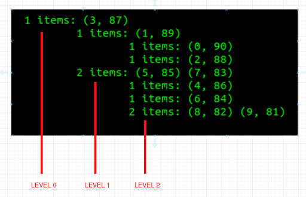
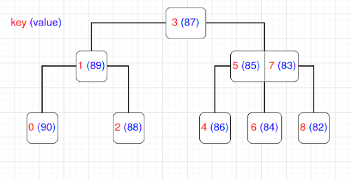

# b_tree_db

## Project task:

A simple database library that organizes records consisting of a key and a value (usually of arbitrary length). The records are stored in a file on disk
and the library offers efficient (i.e. in logarithmic time) addition and removal of records, browsing of the entire database and, most importantly,
searching by key.

## Algorithm:

To achieve efficient (i.e. in logarithmic time) implementation of database operations there exist two types of solution: B-Tree and Hash Tables. I’ve
chosen a B-Tree data structure for storing data in the database. Main reason for this choice was that tree structures allow us to get purely logarithmic
time of all basic operations, while Hash Tables do not support key comparisons and that is why time complexity of basic operations increases by load-factor
of buckets. Detailed definitions, requirements for B-Tree structure and proof of logarithmic time complexity of basic operations can be found in the book
Thomas Cormen et al, [Introduction to Algorithms, Fourth Edition (Chapter 18)](https://mitpress.mit.edu/9780262046305/introduction-to-algorithms/). This book was used by me to research information about principles of how
B-Tree works.

## Implementation details:

Whole library consists of three classes, placed in two separate files. Class BTree and class BTreeNode (in [b_tree.py](https://github.com/stormy131/b_tree_db/blob/main/b_tree.py)) - implementation of tree structure and all basic operations on it (search, insert record, remove record, print tree structure). Class DB_Agent (in [btreedb.py](https://github.com/stormy131/b_tree_db/blob/main/btreedb.py)) - works as a ‘pipe’ between user and BTree. It passes parameters from user to BTree class and checks their validity. Also this class is responsible for file-caching of tree data with help of a built-in Python library [Pickle](https://docs.python.org/3/library/pickle.html). While starting/ending your database session, DB_Agent checks the existence (if doesn’t exist - will create) of a special file <u>‘storage.txt’</u>, where all tree data will be stored in binary format. Also, database can be provided with an external file, containing B-Tree data, and DB_Agent can put all records in your new database (<b>ISSUE</b>: this external file needs to be generated previously by our library, so that classes would deserialize it correctly). All file-caching operations and processes can be enabled/disabled by setting parameter ‘file_caching’ to True/False in DB_Agent initialization. 

## Representation of data:

Method .print_tree() will show data in the console in a specific way. The reason is the structure of a B-Tree. If each node could have at most 2 children (as a binary tree), then graphical representation in the terminal window could be possible. But in the case of B-Tree, the structure can be very complicated. That’s why I decided to limit the implementation just to text-diagram representation. As you can see, each tabulation level represents a new level of depth in the tree. Each node at tabulation level N represents children of the last node at previous level N - 1 (N >= 1). In such a way, showed output represents shown B-Tree: 

 

## Testing

In the library folder there is a file [‘testing.py’](https://github.com/stormy131/b_tree_db/blob/main/testing.py). Run in it to get full report of unit-testing of entire DB_Agent functionality. You can also look at ‘supposed’ usage of library in this file.

